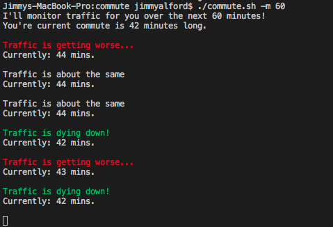

# Commute
Able to see the current travel time from origin to destination. Also has the ability to monitor traffic over a given period of time.

# Setup
In order for commute to work, you need to create your own [Google Maps API Key.](https://cloud.google.com/maps-platform/?__utma=102347093.1842236321.1539017264.1539285058.1539285058.1&__utmb=102347093.0.10.1539285058&__utmc=102347093&__utmx=-&__utmz=102347093.1539285058.1.1.utmcsr=google|utmccn=(organic)|utmcmd=organic|utmctr=(not%20provided)&__utmv=-&__utmk=128501004&_ga=2.48039585.788574857.1539284045-1842236321.1539017264#get-started)
Once you get a key, you'll want to set it as GOOGLE_MAPS_API_KEY within your bash profile.
```
nano ~/.profile
(In your bash profile)
export GOOGLE_MAPS_API_KEY="Your API key"
```
Then reset your profile by running ```source ~/.profile```. You can reset your computer if that doesn't work.
You'll know it's working if you're able to run Commute without any errors.

Then, set your origin and destination by running ```your/path/commute.sh -o``` and follow the command prompt.
You can also manually set the origin and destination within the file but you will need to replace whitespace with a plus sign (+) in order for the url to work correctly.

You're ready to go! You can now run ```commute.sh``` on it's own or with the -m option along with a number to represent how long you would like Commute to monitor traffic for you! It will update you every minute to let you know how traffic is changing.

Have fun and good luck getting home!


# Options
- h - Display this help message.
- m - Monitor your commute over the amount of MINUTES you enter.
- c - Manually enter your origin and destination.
- o - Overwrite current origin and destination.
- p - See what your origin and destination variables are set to.

# Screenshot

